# Neuralume: Smart Air Quality Monitor 

  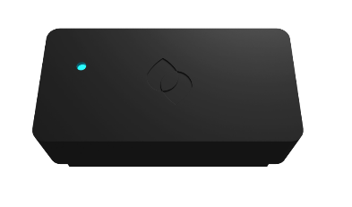

  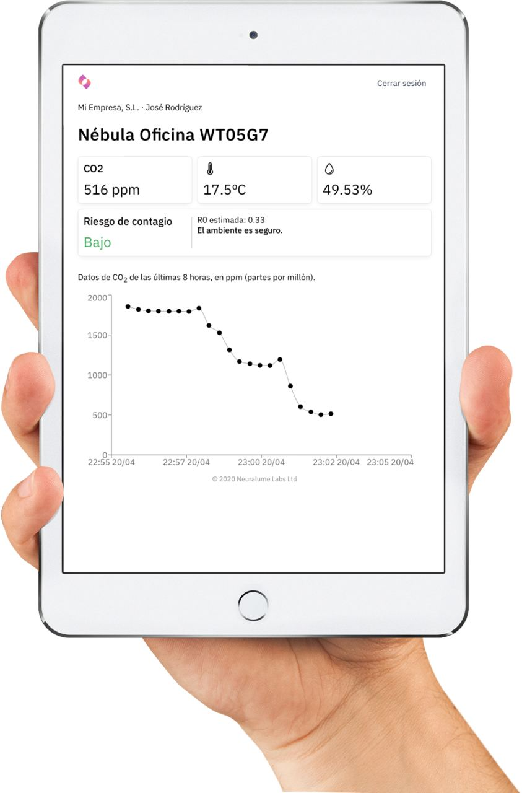
  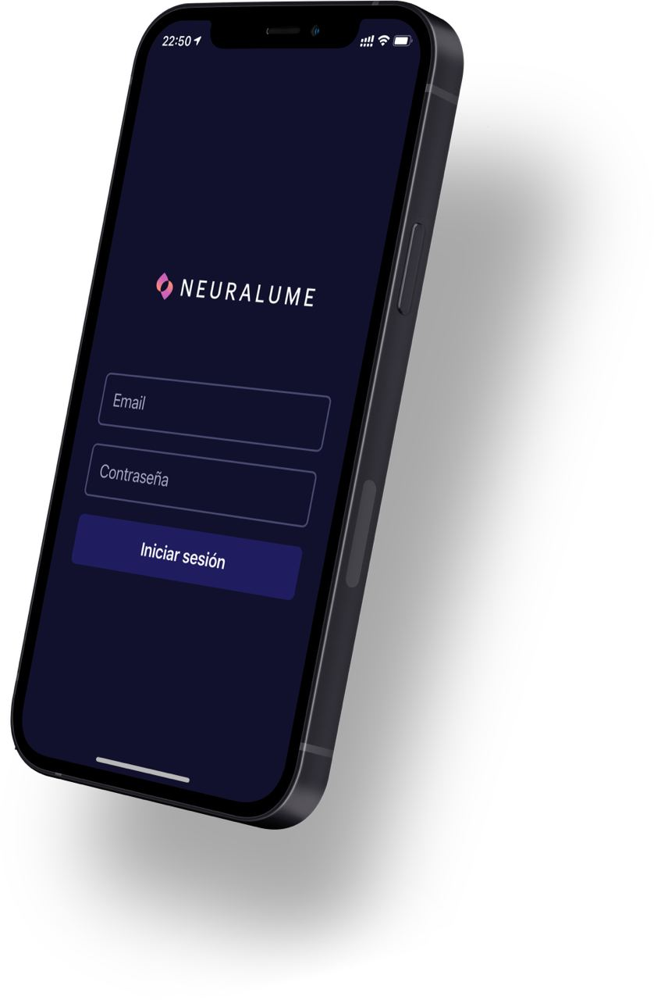

  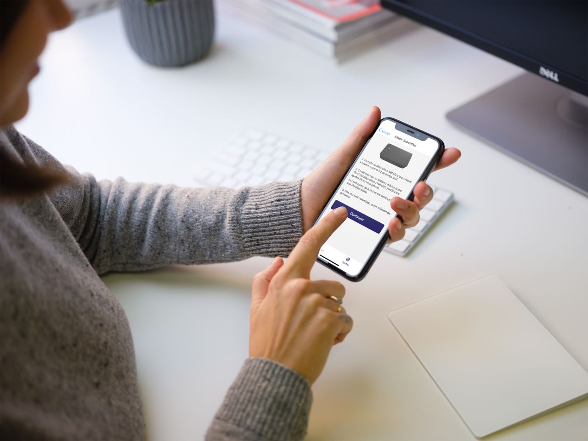

## About Neuralume
Neuralume was a complex project that I embarked on with some friends during our college years, amidst the pandemic. It was our small contribution to the fight against the virus. I successfully brought together three different universities and assembled a team of bright students. Together, we developed a comprehensive solution, which included writing the firmware code, designing the PCB and enclosure, creating a mobile and web app, developing a mathematical model for infection, and handling various business aspects as we aimed to turn this into a viable business.

Now, as I am building my portfolio, I have decided to make this project public. Most of my work has remained private until now, but I believe it's time to share some stuff I have done. Unfortunately, the code was lost when the GitHub organization was deleted. However, I managed to recover **an outdated version of the final project.**

**Special Thanks to All Collaborators for Their Contributions**

Every team member played a vital role in all aspects of this startup-like project. However, their primary contributions were as follows:

- Carlos: Mathematical modeling
- Juan: Web and mobile development
- Ulises: Web scraping and data analysis to support commercial strategy
- Alejandro: Contributing across various areas
- Melani: Commercial strategy
- Pedro (me): Firmware development, translating code from Fortran to Python, and plotting a lot of graphs...

## Some pictures, some history...

It all started as a typical side project that hackers do every day, just messing around:

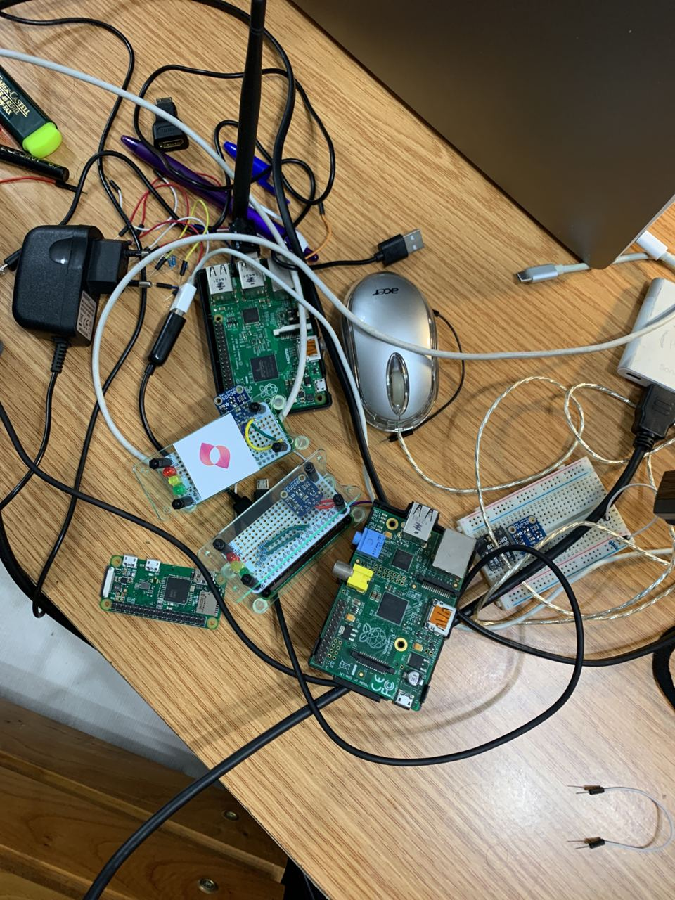

Just a Raspberry Pi, a sensor, some wiring, some coffee and some code. 

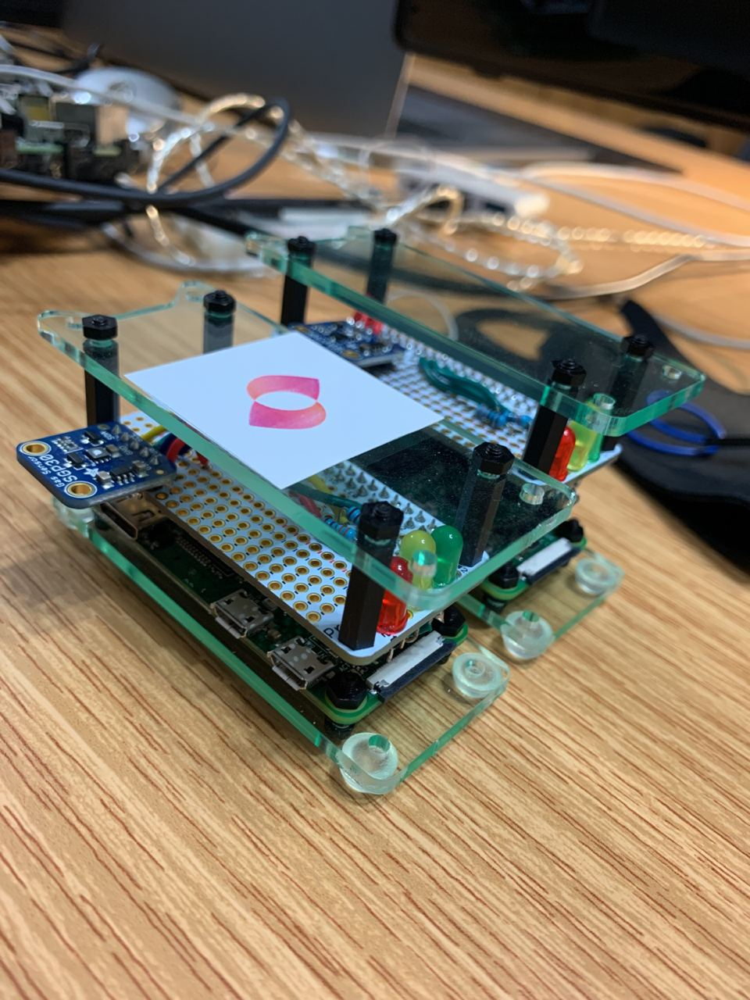

Let's move to an ESP32; we don't need a Raspberry Pi for this! And what if we put it inside a box?

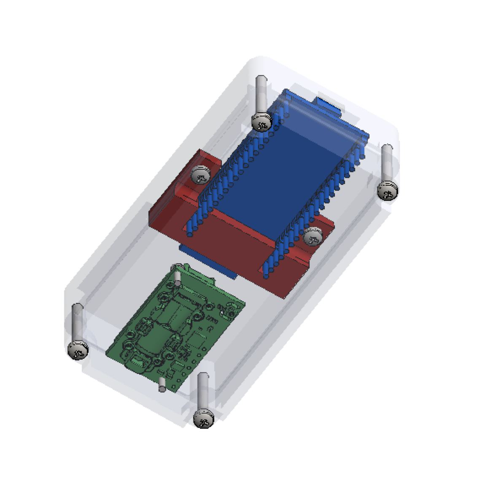
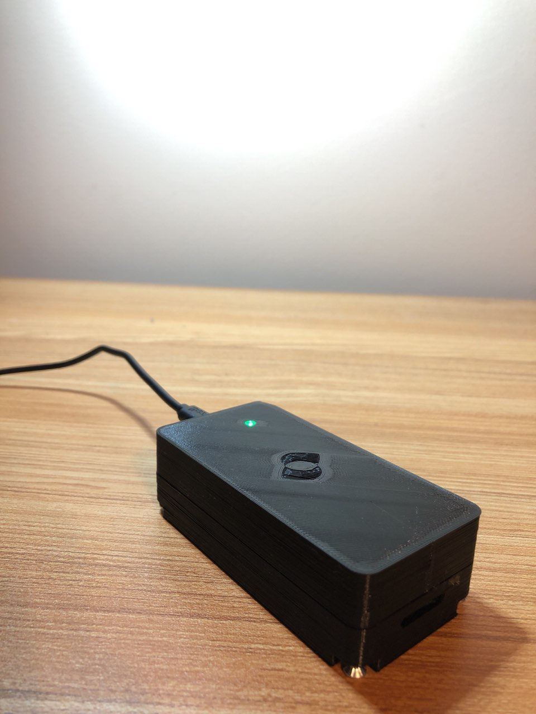
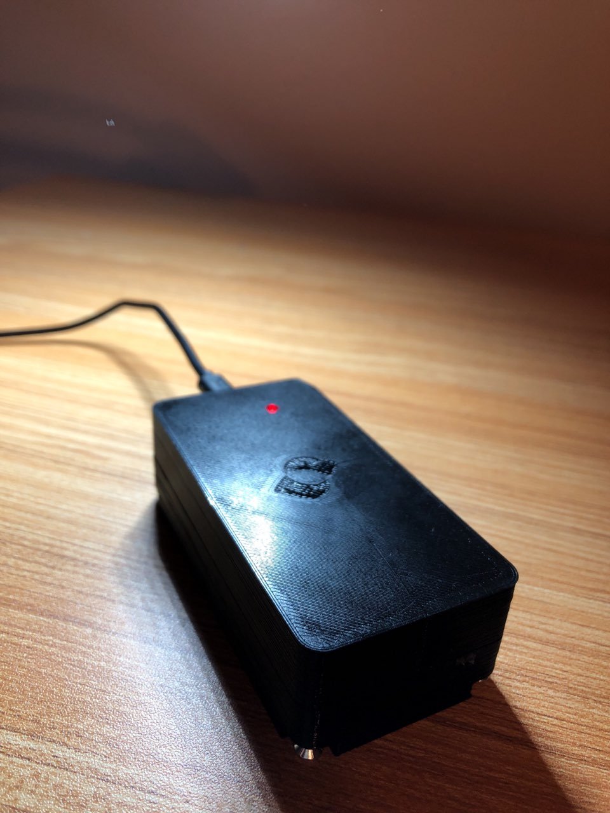
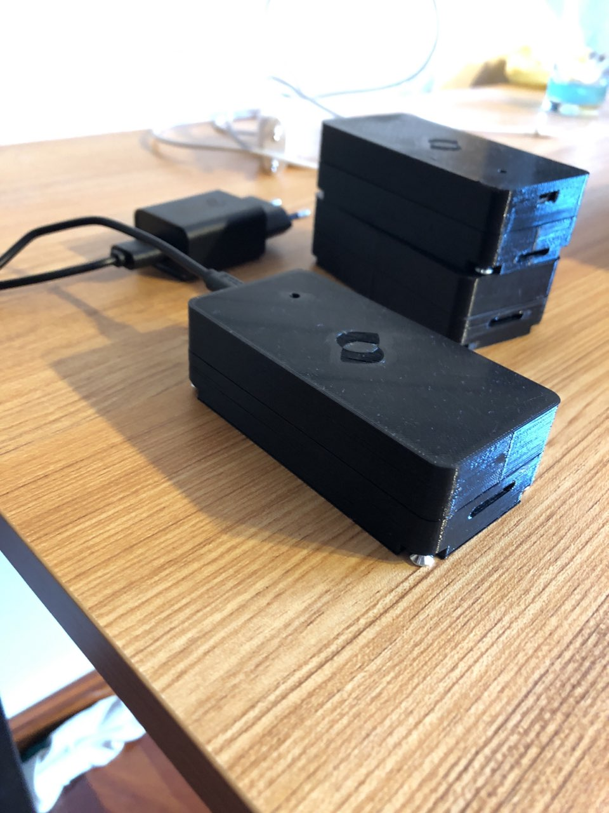

Why not make a PCB and just make it smaller?

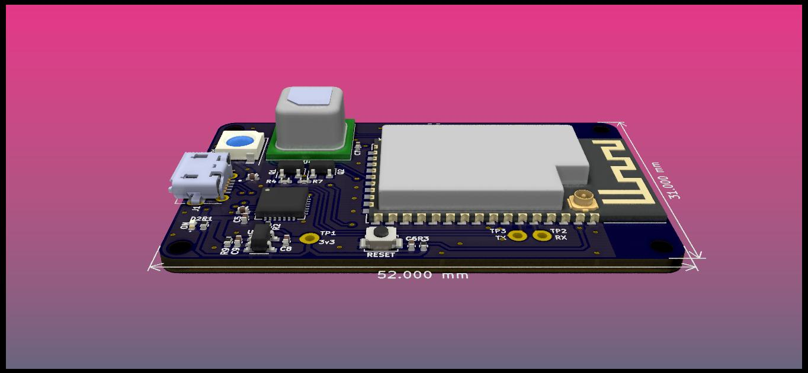
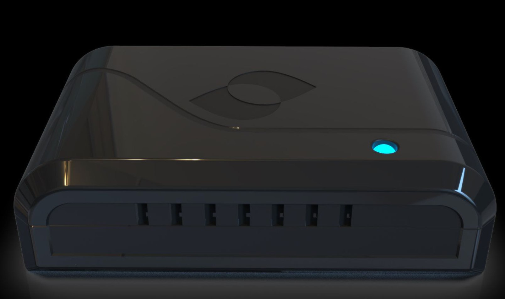
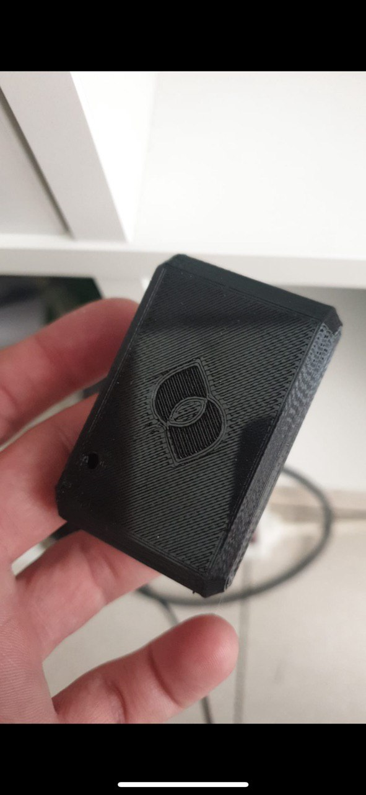
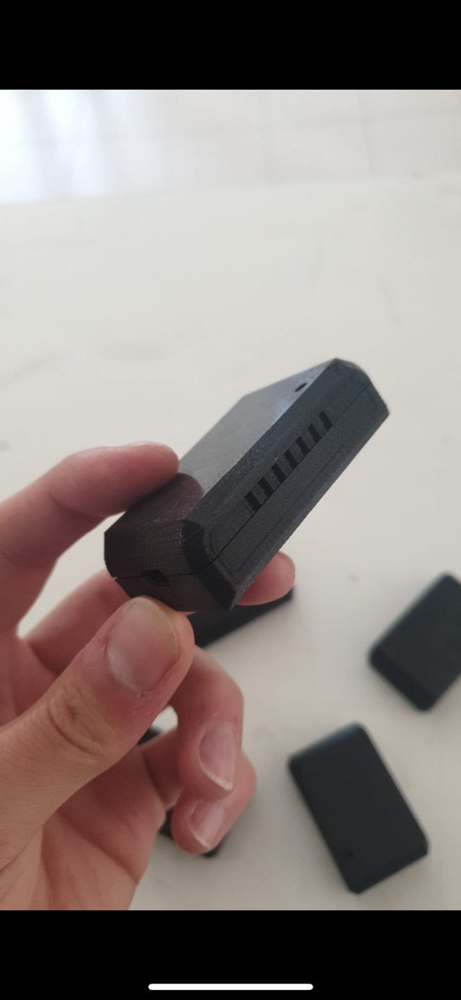
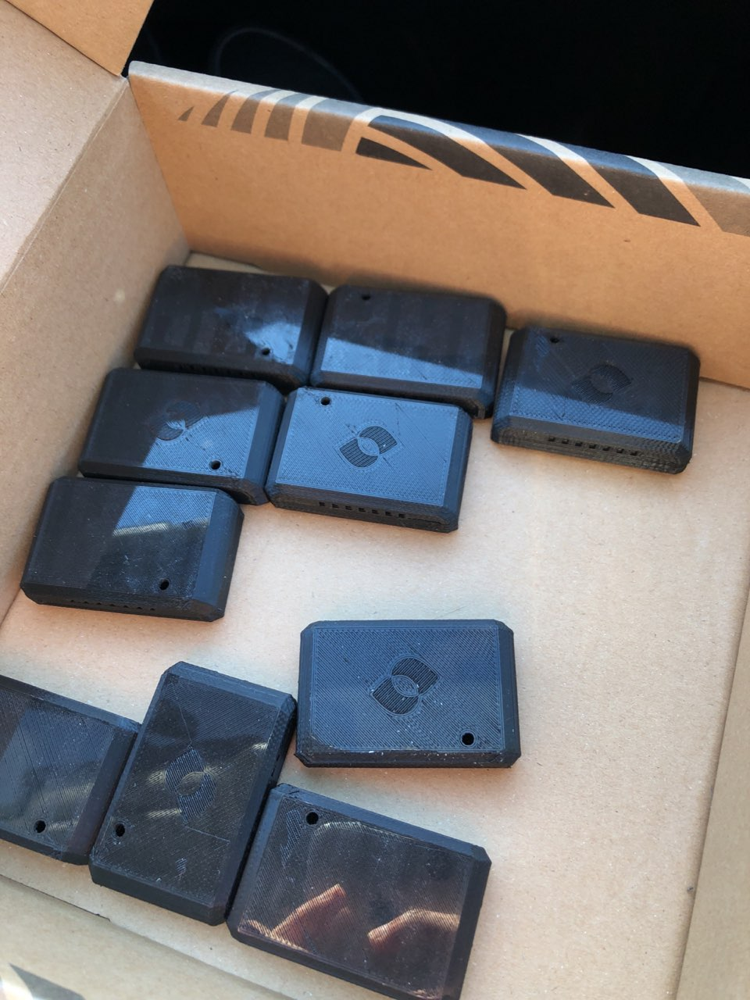
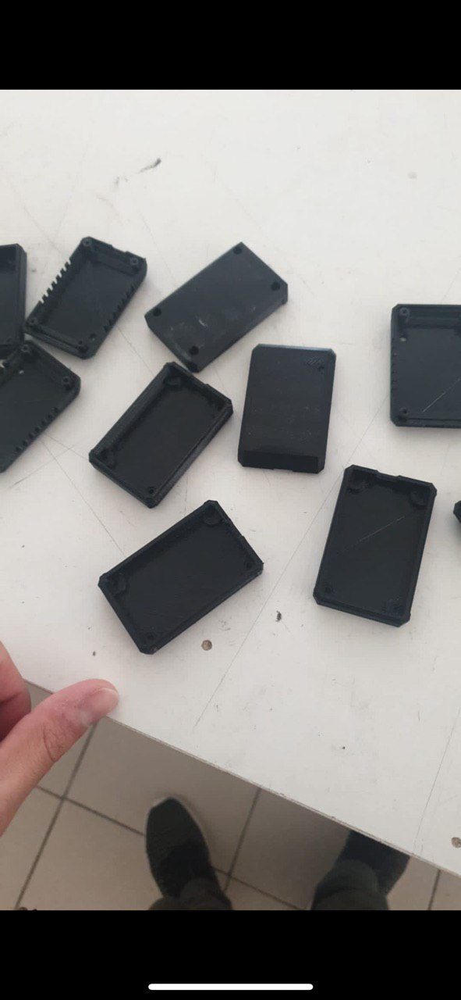

## Folder structure

### Applications

- `/mobile-app`: Hosts the React Native 'Neuralume' mobile app, where users can manage their devices and access a cut-down version of Neuralume Cloud.
   - Development branch: `main`
   - Release branch: `prod/mobile-app`

- `/cloud-web`: Hosts the React 'Neuralume Cloud' web app, where users can access all the data and analysis of their monitors. Production URL: https://cloud.neuralume.com. Staging URL (latest) (to be created) (VPC-protected): https://staging-latest.nelu.net/cloud-web
   - Development branch: `main`
   - Release branch: `prod/cloud-web`
   
 - `/corporate-web`: Hosts the React corporate web app, where users can learn about our company and place orders. Production URL: https://www.neuralume.com. Staging URL (latest) (to be created) (VPC-protected): https://staging-latest.nelu.net/corporate-web
   - Development branch: `prod/corporate-web`
   - Release branch: `main`
   
 - `/api`: Hosts the Django GraphQL/DRF core API, where all the data storage, serving and management of the company happens. Production URL: https://api.neuralume.com. Staging URL (latest) (to be created) (VPC-protected): https://staging-latest.nelu.net/api
   - Development branch: `prod/api`
   - Release branch: `main`

 - `/nebula`: Hosts the Arduino/ESP32 Nebula firmare that our Nebula boards run.
   - Development branch: `prod/nebula`
   - Release branch: `main`

### Resources

 - `/corporate-assets`: This folder hosts rendered and source versions of our corporate assets, so that they can be easily copied into any other project. 
   - Development branch: (currently not under development)
   - Release branch: `main`

